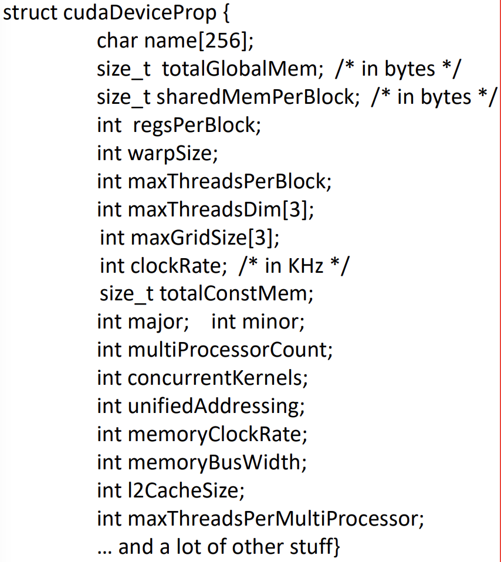

* Software Components
  * Blocks
  * Kernel
  * Threads
  * Grid
* Hardware Components
  * Warp --> Collection of threads
  * SM --> Streaming Multiprocessor
  * SP

* Restrictions of hardware/software
  * All threads execute same kernel
  * Dimensions of kernel can't change
  * Block must execute entirely by the SM
* Compute Capability
  * Number in form x.y
  * Way to expose hardware resources
  * **cudaGetDeviceProperties()**

#### cudaGetDeviceProperties()
* Called by the host to get info about the device properties



* you can also use **cudaGetDeviceCount(int* count)** to get num devices

```c
int numDevices;
cudaGetDeviceCount(numDevices);
for (int deviceID = 0; deviceID < numDevices; deviceID++) {
  cudaDeviceProp prop;
  cudaGetDeviceProperties(&prop, deviceID);
  printf("Device ID %d is called %s\n", deviceID, prop.name);
}
```

#### Synchronization Points
```c
__syncthreads()
```
* Only threads **in the same block** can sync
 * Why? *to prevent a deadlock*
* Thread that makes call will be held at location until every thread reaches that location
* Be weary of if-then-else
 * IF sync threads are different, you will get a deadlock
* Ability to execute same app code on hardware with different number of execution resources --> transparent scalability

#### Scheduling of Blocks
* Block needs resources assigned beforehand --> Before being given to an SM
* CUDA runtime --> Reduces number of blocks until resource usage is < limit
* Runtime System
 * Maintains list of blocks
 * Assigns new blocks to SM

##### Characteristics of a Resource
* Must be inside the SM
 * Must be determined before kernel launch
* Example of SM Resources
 * Registers
 * Shared memory
 * Num of threads that can be tracked/scheduled

### Warps
* *Block* is divided into units called **Warps**
* Outside of your control but *deterministic*
 * Partitioning is ALWAYS the same
 * Thread IDs within a warp are consecutive
  * Warp 0: [0,31]
  * Warp 1: [32, 63]
  * Warp 3: [64...]
* Warp size = Implementation Specific
 * NVIDIA GPUs --> warp = 32  

#### Branch Divergence in Warps
* Occurs when threads branch to *different* execute paths
* You can get major performance losses

#### Latency Tolerance
* Latency Hiding --> When instructions must wait for a long-latency op to complete
* Zero-Overhead Thread Scheduling --> Scheduling does not introduce idle time

### Mythbusting about CUDA
* GPUs does not have very wide SIMD machines
 * No, CUDA Warp has 32 threads
* Branchin is possible 
* GPUs are power-efficient (performance per watt)
* Third party wrappers exist for Java, Python, and more
