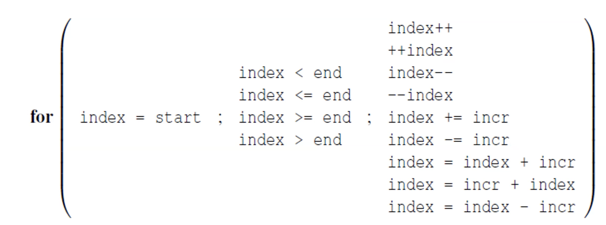

# OpenMP Programming in C

## Basic Example
```c
#include <stdio.h>
#include <stdlib.h>
#include <omp.h>

int main() {
  // DOES NOT CREATE THREADS, sets the number of planned threads
  omp_set_num_threads(16);
  
  // Do this in parallel
  // Pragma --> "Create this"
  #pragma omp parallel
  {
    printf("Hello World!\n");
  }
  
  return 0;
}
```
* Only the code **in the brackets** will be in parallel, outside, it will collapse all threads
* It **adds 15 threads**, it doesn't create 16 - The master thread remains
* If you do not specify how many theads, it will set **num threads = num cores**

## Basics
* **API in C** for shared-memory systems
* Designed for **threading**
* OpenMP **does not run** on distributed memory systems
* Meant to parallelize **for-loops** originally
```c
void main() {
  double arr[1000];
  
  #pragma omp parallel for
  for(int i=0;i<1000;i++){
    do_something(arr[i]) 
  }
}
```
* Can parallelize many serial programs w/ FEW ANNOTATIONS
* OpenMP is a small API - Hides **cumbersome threading calls with simpler directives**

## Pragmas (#pragma)
* Special preprocessor instructions
* Specific by C standard
* Compilers that don't support pragma, ignore them
### Clauses
* Text that modifies a directive
* Example: num_threads
```c
#pragma omp parallel num_threads(10)
```
* num_threads is the clause

## Critical Sections - Mutex
```c
#pragma omp critical
global_result += my_result
```
* ONLY ONE THREAD can execute the structured block at a time

## Example - Getting thread rank
```c
void main() {
  int thread_count = 10;
  #pragma omp parallel num_threads(thread_count)
  Hello();
  
  return 0;
} 
void Hello(void) {
  int my_rank = omp_get_thread_num();
  int thread_count = omp_get_num_threads();
}
```

## Prevent atomic accesses
* We need to make sure that something is accessed **atomically**, only one thread at one time
```c
  #pragma omp parallel for
  for(int i=0;i<1000;i++){
    #pragma omp atomic
    do_something(arr[i]) 
  }
}
```
* You are sequential now **AND** it's slower than single thread

### How to enhance atomic operations (nowait)
* No wait will tell the thread to keep going after it finishes a block
```c
  #pragma omp parallel for
  for(int i=0;i<1000;i++){
    #pragma omp nowait
    for(...){}
    #pragma omp atomic
    do_something(arr[i]);
  }
}
```
### Single/Master Thread
* This code is only executed by the master thread
```c
  #pragma omp parallel for
  for(int i=0;i<1000;i++){
    #pragma omp single
    do_something(arr[i]);
  }
}
```

* Atomic Ops --> Expensive
* Synchronization --> Correctness vs. Performance

## OpenMP Reduction Clause
```c
  #pragma omp parallel for
  for(int i=0;i<1000;i++){
    // reduction(<operator>: <variable list>);
    reduction(+, some_arr);
  }
}
```

## Public/Private/Shared Variables
* **default(none)** forces you to explicitly say which vairables are shared and private
```c
  #pragma omp parallel for num_threads(thread_count) \
    default(none), shared(some_arr), private(i)
  for(int i=0;i<1000;i++){
    reduction(+, some_arr);
  }
}
```

## Scheduling - Schedule Clause
* Types
  * Static --> Iterations can be assigned before loop is executed

```c
schedule(static, 1)
// Each thread gets 1 iteration, round robin
// T0: [0,3,6,9]
// T1: [1,4,7,10]
// T2: [2,5,8,11]
```
```c
schedule(static, 4)
// Each thread gets 1 iteration, round robin
// T0: [0,1,2,3]
// T1: [4,5,6,7]
// T2: [8,9,10,11]
```
  * Dynamic/Guided --> Iterations are assigned while loop is executing
  * Auto --> Run-time determines schedule 
```c
  #pragma omp parallel for
  for(int i=0;i<1000;i++){
    // reduction(<operator>: <variable list>);
    reduction(+, some_arr);
  }
}
```

## Only For-Loops that can be Parallelized


## Running OpenMP Code
```shell
gcc -g -Wall -fopenmp -o omp_hello omp_hello.c
./omp_hello
```

# Queues in OpenMP
* Data structure in multithreaded apps
* Enqueue and Dequeue
* Several 'producer' threads and 'consumer' threads
  * Producers --> Produce request for data
  * Consumer --> Consume the data

### Example: Message-Passing
* Each thread has shared message queue
* Any thread can enqueue messages in another thread
  * Only owner can dequeue

## Locks
* Locks --> Data structure that enforces **mutual exclusion**
* Lock is slow --> OS is managing data structures
  * **slower than ATOMIC** 
* Do not mix atomic and critical for same variable
```c
omp_lock_t lock_p;
omp_init_lock(lock_p);
omp_set_lock(lock_p);
omp_unset_lock(lock_p);
omp_destroy_lock(lock_p);
```
* No guarantee of fairness in MUTEX
  * Thread can be blocked forever
* Can be dangerous to NEST Mutex constructs

## Sections
```c
#pragma omp parallel sections
{
  #pragma omp section
  { 
    // One thread will execute this
    printf ("id = %d, \n", omp_get_thread_num());
  }
  #pragma omp section
  { 
    // Another thread will execute this
    printf ("id = %d, \n", omp_get_thread_num());
  }
}
```
